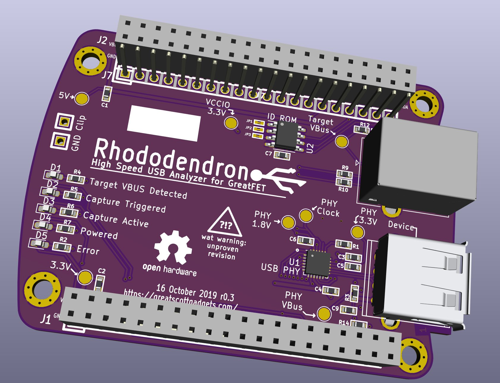
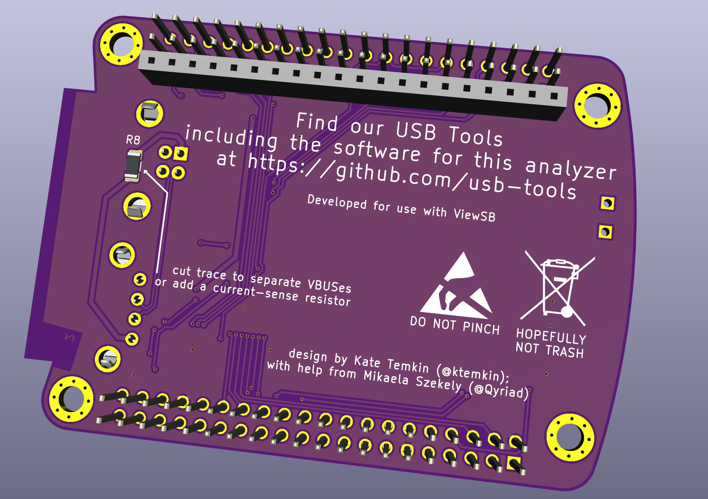

# GreatFET Rhododendron

This is very early progress of a High-Speed USB analysis neighbor for GreatFET. More details to come.

## PCB

Pictures by [Kate Temkin](https://twitter.com/ktemkin/status/1184521332832161792)
